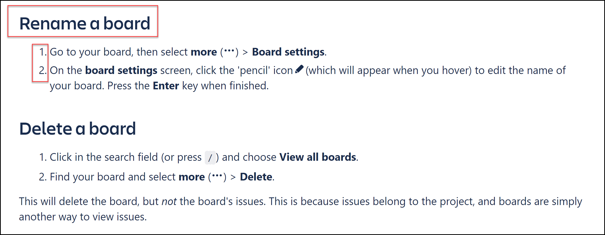
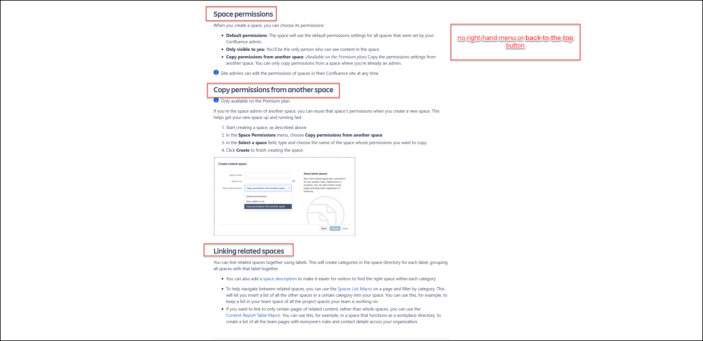
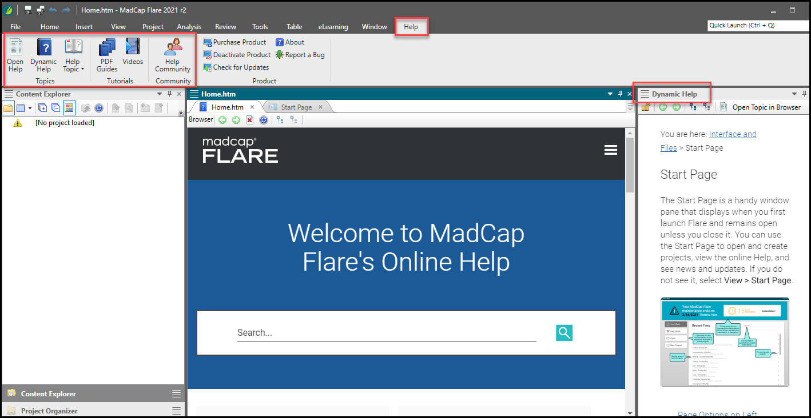

<!-- Introduction -->
This page contains pros and cons of Jira, Confluence and MadCap Flare documentation.

- [Jira and Confluence](#jira-and-confluence)
  - [Pros](#pros)
    - [Quickstart menu](#quickstart-menu)
    - [Easy access to documentation and on-line courses](#easy-access-to-documentation-and-on-line-courses)
    - [Clear structure and well organized content](#clear-structure-and-well-organized-content)
  - [Cons](#cons)
    - [Too many topics in one artcile](#too-many-topics-in-one-artcile)
    - [Bad quality screenshots](#bad-quality-screenshots)
    - [No language versions](#no-language-versions)
    - [A lot of knowledge](#a-lot-of-knowledge)
- [MadCap Flare](#madcap-flare)
  - [Pros](#pros-1)
    - [Easy to find](#easy-to-find)
    - [Easy to navigate](#easy-to-navigate)
    - [Clear structure](#clear-structure)
  - [Cons](#cons-1)
    - [Hard to find](#hard-to-find)

# Jira and Confluence

**Jira** and **Confluence** come from one supplier - **Atlassian**, and they are very similar therefore I present them together.

## Pros

### Quickstart menu
* A great point to start, if you are new to the tool.  
* It opens automatically once you enter the page for the first time and offers a start tour.  
* It is always accessible under the **Quick start** icon. 
  
  

### Easy access to documentation and on-line courses

* Help panel is available under the **question mark** button at the top-right corner. 
* **Search bar** is on the top - we can start looking for an answer without going through all the documentation.
* In Jira view you will see a couple of useful articles on the top.
* Below there are links to [online courses](https://university.atlassian.com/student/path/871316), documentation in [online help center](https://support.atlassian.com/jira-software-cloud/resources/) form and [community help](https://community.atlassian.com/?tempId=eyJvaWRjX2NvbnNlbnRfbGFuZ3VhZ2VfdmVyc2lvbiI6IjIuMCIsIm9pZGNfY29uc2VudF9ncmFudGVkX2F0IjoxNjM3MjUxODU1NzE2fQ==) where you can ask questions and discuss with other Atlassian users.  
  
  
### Clear structure and well organized content

  * All content is grouped in [few main sections](https://support.atlassian.com/jira-software-cloud/resources/)
  * Each setion contain links to the more detailed articles
  * Artciles are divided by different topics and tasks
  * Tasks are described in a simple way, using numbered list, simple commands, bold and italic.   
  
  * Interface is clear and rather minimalistic

## Cons

### Too many topics in one artcile

* In some articles you can find a lot of content whithout information on the top what's inside. It needs a lot f scrolling down to find what you're loooking for. 
* There's no **go back** or **back to the top** button, so you need to scroll again  
  

### Bad quality screenshots

* some of the screenshots are unreadible or too small 

### No language versions

* The documentation is not avalibale in other languages than english or it is very hard to find

### A lot of knowledge

* There are many different sources of knowledge: quick start, on-line courses (atlassian university), help articles, community. It is hard to choose what to read first - probably a new user will read almost nothing and experiment on his own.
* Atlassian university which contains many useful videos and courses both for Jira and Confluence users can be open only from jira view.

# MadCap Flare

## Pros

### Easy to find

* Help Section is available from the top ribbon and it is divide by **Topics**, **Tutorials** and **Help Community**.
* Help resources in PDF version can be viewed directly from program window.
* There is also in-build **Dynamic Help**  
  

### Easy to navigate

### Clear structure

## Cons

### Hard to find

* [MadCap webpage](https://www.madcapsoftware.com/products/flare/?utm_source=Google&utm_medium=ad-google-search&utm_campaign=Brand&utm_content=Flare&gclid=CjwKCAiAs92MBhAXEiwAXTi251CJpwDWGA9jKoQngS5ZPtKfTmNJ_yqI1uj7zsStdBEgBt_QrYlC5hoCjaEQAvD_BwE) contains **Support** section on the top, but it contains many sections and it takes a moment to find **Flare** documentation

