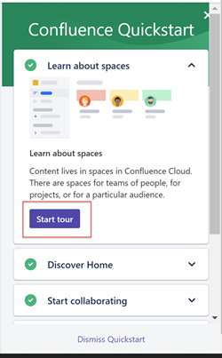
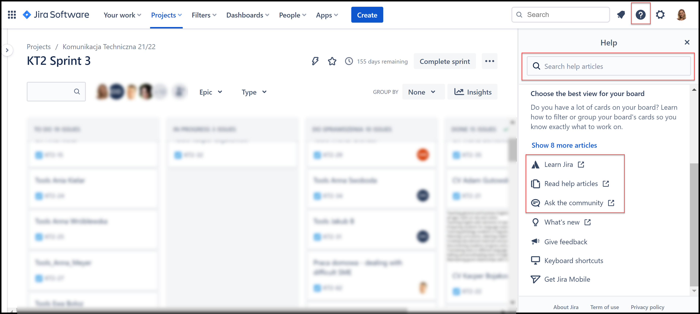

<!-- Introduction -->
This page contains pros and cons of Jira, Confluence and MadCap Flare documentation.

- [Jira and Confluence](#jira-and-confluence)
  - [Pros](#pros)
    - [Quickstart menu](#quickstart-menu)
    - [Easy access to documentation and on-line courses](#easy-access-to-documentation-and-on-line-courses)
    - [Clear structure and well organized content](#clear-structure-and-well-organized-content)
  - [Cons](#cons)
    - [A lot of knowledge](#a-lot-of-knowledge)
- [MadCap Flare](#madcap-flare)
  - [Pros](#pros-1)
  - [Cons](#cons-1)

# Jira and Confluence
## Pros

### Quickstart menu
* A great point to start, if you are new to the tool.  
* It opens automatically once you enter the page for the first time and offers a start tour.  
* It is always accessible under the **Quick start** icon.   
  
  

### Easy access to documentation and on-line courses

* Help panel is available under the **question mark** button at the top-right corner. 
* **Search bar** is on the top - we can start looking for an answer without going through all the documentation.
* In Jira view you will see a couple of useful articles on the top.
* Below there are links to [online courses](https://university.atlassian.com/student/path/871316), documentation in [online help center](https://support.atlassian.com/jira-software-cloud/resources/) form and [community help](https://community.atlassian.com/?tempId=eyJvaWRjX2NvbnNlbnRfbGFuZ3VhZ2VfdmVyc2lvbiI6IjIuMCIsIm9pZGNfY29uc2VudF9ncmFudGVkX2F0IjoxNjM3MjUxODU1NzE2fQ==) where you can ask questions and discuss with other Atlassian users.  
  
  
### Clear structure and well organized content

  * all content is grouped in [few main sections](https://support.atlassian.com/jira-software-cloud/resources/)
  * each setion contain links to the more detailed articles
  * artciles are write in simple language

## Cons

### A lot of knowledge

* There are many different sources of knowledge: quick start, on-line courses (atlassian university), help articles, community. It is hard to choose what to read first - probably a new user will read almost nothing and experiment on his own.
* Atlassian university which contains many useful videos and courses both for jira and confluence users can be open only from jira view.

# MadCap Flare

## Pros

## Cons

<!-- Example for Images -->

<!-- Example for Tables -->

| table header | table header |
| ------------ | ------------ |
| content      | content      |
| content      | content   ss   |

<!-- Paragraph after table -->
<!--table of content-->

